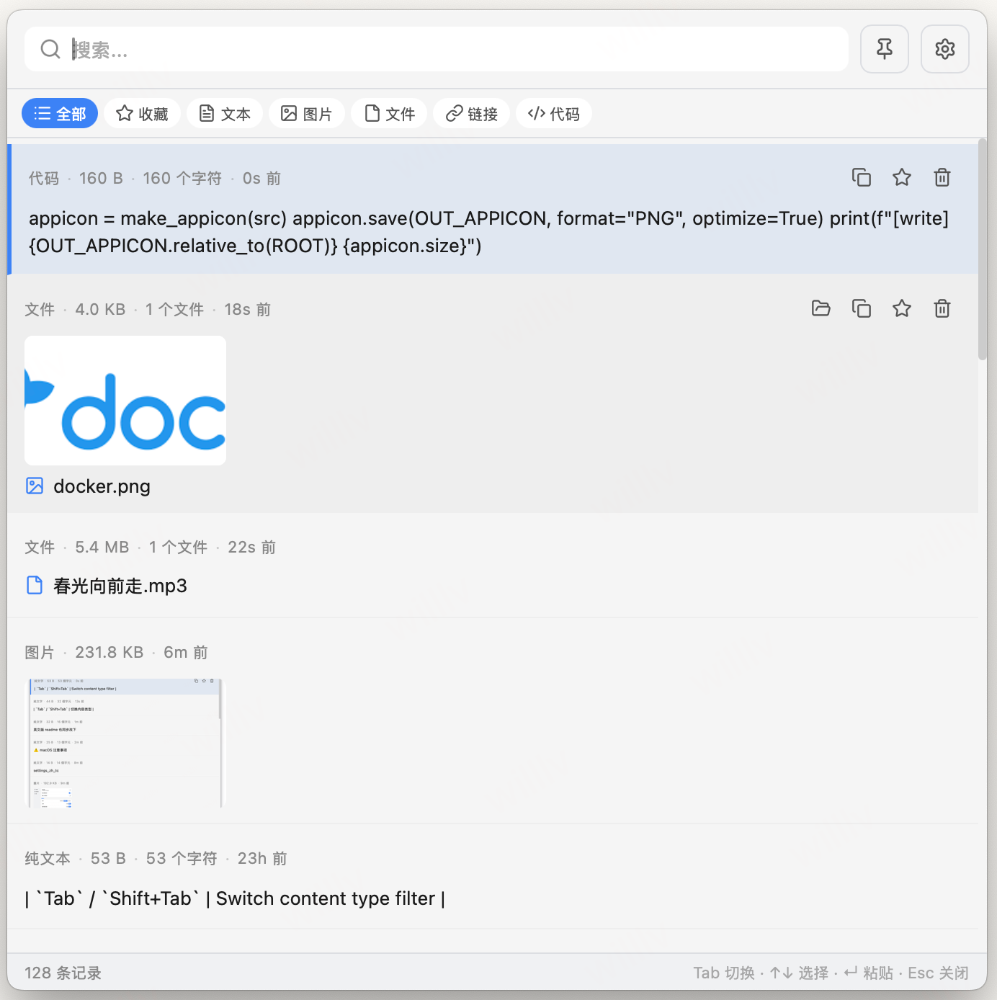
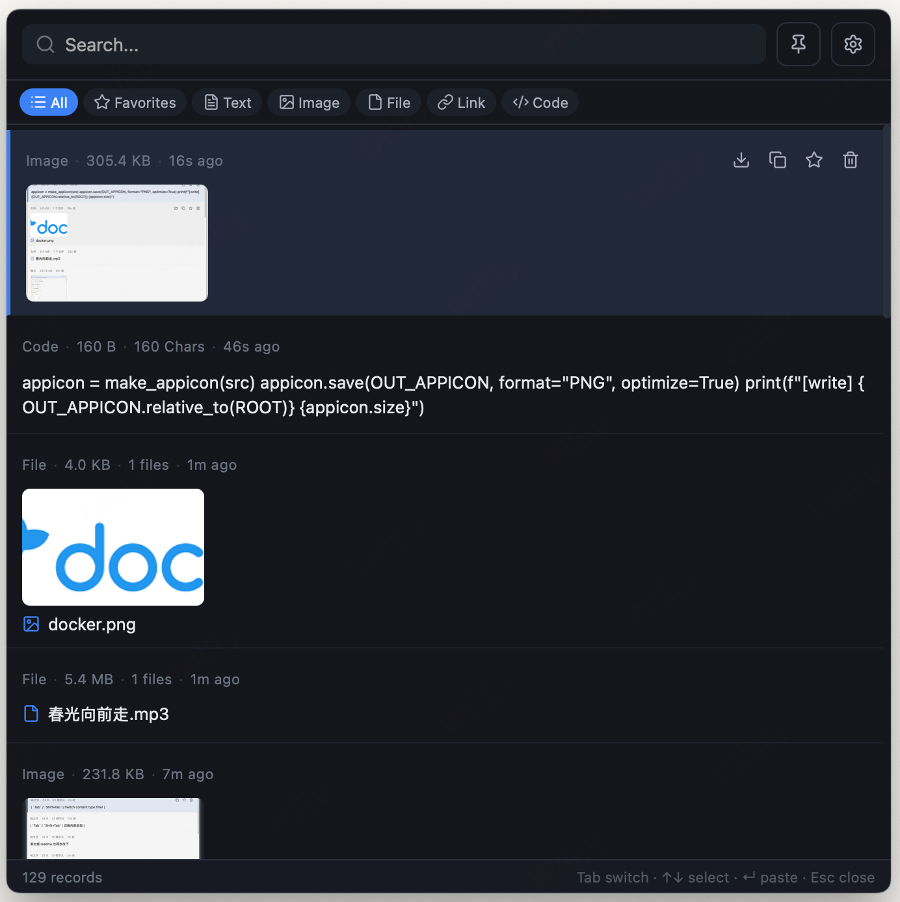
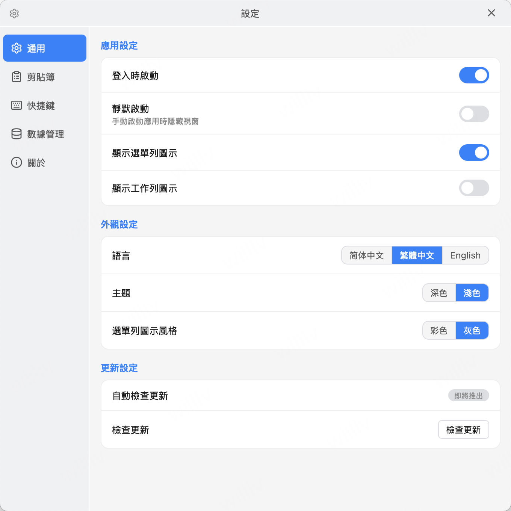

<div align="center">


# GoPaste

**轻量、快速、安全的跨平台剪贴板管理工具**

[](https://github.com/GoPaste/GoPaste/releases)
[](LICENSE)
[](https://github.com/GoPaste/GoPaste/releases)
[](https://golang.org)

[简体中文](#) · [English](README.en.md) · [官网](https://gopaste.wetools.cc/)

</div>


---

## ✨ 功能特性

- 🕐 **自动记录** — 后台静默监听剪贴板，文本、图片、链接、代码、文件全类型支持
- ⚡ **即按即用** — 全局快捷键 <kbd>Alt</kbd> + <kbd>\`</kbd> 一键呼出，无需切换窗口（支持自定义）
- 🔍 **快速搜索** — 实时全文搜索 + 类型筛选，毫秒级定位历史内容
- ⭐ **收藏 & 置顶** — 标记重要内容永久保留，置顶条目始终置于列表顶部
- 🔐 **本地加密** — 所有内容使用 AES-256-GCM 加密存储，密钥托管于系统 Keychain，数据永不上云
- 🖥️ **三端原生** — 深度适配 Windows、macOS、Linux，安装包 ≤ 20 MB
- 🎨 **双主题** — 深色 / 浅色主题自由切换
- 🌏 **多语言** — 简体中文、繁體中文、English
- 📤 **数据导出** — 一键导出 JSON，数据自由掌控

---

## 📦 下载安装

前往 [GitHub Releases](https://github.com/GoPaste/GoPaste/releases) 下载最新版本。

| 平台 | 文件 | 备注 |
|------|------|------|
| Windows x64 绿色版 | `GoPaste_x.x.x_windows_x64-portable.exe` | 双击直接运行，无需安装 |
| Windows x64 安装版 | `GoPaste_x.x.x_windows_x64-setup.exe` | 含安装向导，自动创建快捷方式 |
| Windows x86 绿色版 | `GoPaste_x.x.x_windows_x86-portable.exe` | 32 位系统 |
| macOS Apple Silicon | `GoPaste_x.x.x_darwin_aarch64.dmg` | M 系列芯片 |
| macOS Intel | `GoPaste_x.x.x_darwin_x64.dmg` | Intel 芯片 |
| macOS Universal | `GoPaste_x.x.x_darwin_universal.dmg` | 兼容 Apple Silicon & Intel |
| Linux x64 | `GoPaste_x.x.x_linux_x64.tar.gz` | 需系统托盘支持（X11） |

---

## 🚀 快速上手

1. 下载并启动 GoPaste，应用自动驻留系统托盘
2. 正常复制任意内容（文本、图片、链接…），GoPaste 自动在后台记录
3. 按 <kbd>Alt</kbd> + <kbd>\`</kbd> 呼出面板
4. 搜索或浏览历史，点击条目即可粘贴到当前应用

**快捷键速查：**

| 键 | 动作 |
|----|------|
| `Tab` / `Shift+Tab` | 切换内容类型 |
| `↑` / `↓` | 上下选择条目 |
| `Enter` | 粘贴选中条目 |
| `Esc` | 关闭面板 |
| `Delete` | 删除选中条目 |

---

## 🖼️ 界面预览

<details open>
<summary>简体中文界面</summary>



</details>

<details>
<summary>English Interface</summary>



</details>

<details>
<summary>繁體中文介面</summary>



</details>

---

## 🗺️ 路线图

- [ ] 导入数据（JSON 恢复）
- [ ] 富文本 / HTML 格式保留
- [ ] 自动更新（直接下载安装）
- [x] CI/CD 自动构建 & 发布
- [ ] Linux AppImage / deb / rpm 分发包
- [ ] 快捷数字键粘贴（按 `1~9` 直接粘贴对应条目）
- [ ] 多设备 E2E 加密同步

---

## ⚠️ macOS 注意事项

### 首次打开提示"身份不明的开发者"

GoPaste 当前版本未使用 Apple Developer 证书签名（ad-hoc 签名），首次启动时 macOS Gatekeeper 会拦截。

**解决方法：**

1. 将 `GoPaste.app` 拖入「应用程序」文件夹
2. 双击运行（被拦截是正常现象，关掉提示框）
3. 打开「系统设置 → 隐私与安全性」，滚动到底部点击**「仍要打开」**

> 也可在 Finder 中**右键 → 打开**，然后在弹框中点「打开」。

### 提示"已损坏，无法打开"

在终端执行：

```bash
xattr -cr /Applications/GoPaste.app
```

### 辅助功能权限（模拟粘贴必需）

GoPaste 通过模拟 `Cmd+V` 将内容粘贴到目标应用，需要「辅助功能」权限。

首次触发粘贴时系统会弹出授权框，按引导授权即可。

> ⚠️ **每次升级后**需要在「系统设置 → 隐私与安全性 → 辅助功能」中，先**删除**旧的 GoPaste 授权记录，再重新授权。否则面板消失但内容未粘出。
>
> 详见 [macOS 辅助功能说明](docs/macos-accessibility.md)

---

## 🤝 参与贡献

欢迎提交 Issue 和 Pull Request！

- **Bug 反馈** → [GitHub Issues](https://github.com/GoPaste/GoPaste/issues)
- **功能建议** → [GitHub Discussions](https://github.com/GoPaste/GoPaste/discussions)
- **开发指南** → 参阅 [CONTRIBUTING.md](docs/CONTRIBUTING.md)（即将补充）

---

## 📄 License

[Apache-2.0](LICENSE) © 2026 larkwins
